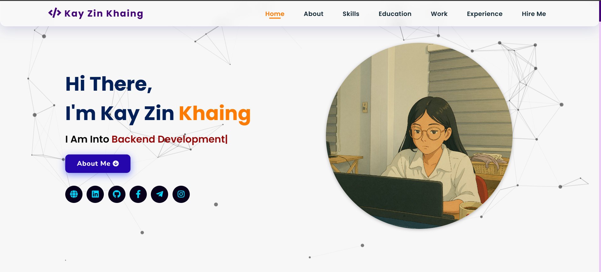

# 💼 My Developer Portfolio

Welcome to my personal developer portfolio!  
This site showcases my experience, projects, and technical skills as a full-stack web developer.

🔗 **Live Preview:** [kayzinkhaing.github.io/my-portfolio](https://kayzinkhaing.github.io/my-portfolio)

---

## 📌 Features

- ✨ Interactive and responsive design
- 📁 Project showcase with GitHub/code/demo links
- 📬 Contact form powered by [EmailJS](https://www.emailjs.com/)
- 🌙 Dark/light theme toggle *(if added)*
- 📱 Mobile-first layout

---

## 🧰 Built With

- **HTML5**, **CSS3**, **JavaScript (jQuery)**
- **EmailJS** – Contact form backend
- **Font Awesome** – Icons
- **GitHub Pages** – Hosting

---

## 📸 Preview

 <!-- Optional, update path if needed -->

---

## 🚀 How to Use Locally

```bash
# Clone the repository
git clone https://github.com/kayzinkhaing/my-portfolio.git

# Open index.html in your browser
